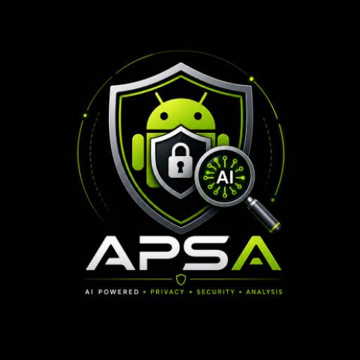
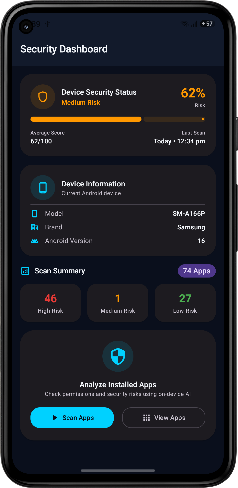
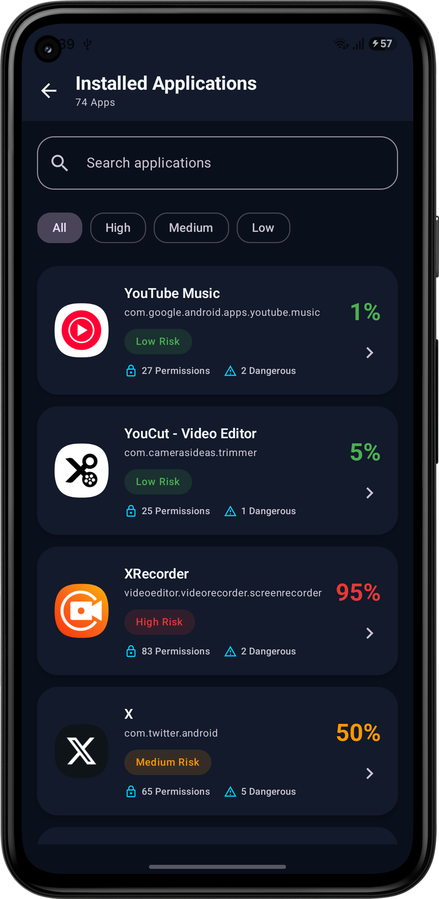
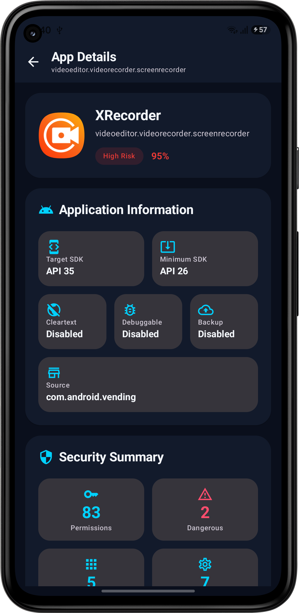

# APSA – AI Privacy & Security Analyzer

<p align="center">
  
</p>

<p align="center">


</p>

# An On-Device AI-Assisted Framework for Privacy and Security Risk Assessment of Android Applications Based on Permissions and Exported Components

**APSA (AI Privacy & Security Analyzer)** is an Android application developed for an MSc Cyber Security and Digital Forensics research project.

The application performs **on-device privacy and security risk assessment** of installed Android applications using:

- Static Android application analysis
- TensorFlow Lite machine learning
- Google Gemma LiteRT Large Language Model
- Explainable AI (XAI)

Unlike cloud-based solutions, APSA performs **all analysis locally** on the Android device without transmitting user data over the Internet.

---

# Features

- Scan installed Android applications
- Analyse permissions
- Detect dangerous permissions
- Analyse exported Activities, Services, Receivers and Providers
- Generate AI-based risk scores
- Explain security risks using Google Gemma
- Fully offline processing
- Privacy-preserving architecture

---

# Demo

<p align="center">

</p>

---

# Screenshots

<p align="center">





</p>

---

# Requirements

## Android Device

| Requirement | Minimum |
|------------|---------|
| Android Version | Android 8.0 (API 26) or later |
| RAM | 4 GB |
| Free Storage | 3 GB |

---

## PC / Laptop

A Windows PC or Laptop is required **only once** to copy the Gemma AI model to the Android device.

| Requirement | Minimum |
|------------|---------|
| Operating System | Windows 10 / Windows 11 |
| USB Port | Required |
| USB Cable | Required |
| Free Disk Space | 3 GB |
| Internet Connection | Required only for downloading the AI model |

---

# Installation Guide

## Step 1 — Install APSA

Navigate to the following directory in this repository:

```text
APK
└── release
    └── app-release.apk
```

Download or copy **app-release.apk** to your Android phone's internal storage (e.g., the **Downloads** folder).

On your Android device:

1. Locate **app-release.apk**.
2. Tap the APK file to begin installation.
3. If prompted, allow **Install from Unknown Sources**.
4. Complete the installation.
5. Open **APSA** once, then close the application.

> **Note:** Opening the application once creates the required application directory used to store the Gemma AI model. After closing the app, continue with the next steps to copy the model.

---

## Step 2 — Download the AI Model

Download the following LiteRT model on the PC/Laptop.

```
gemma-4-E2B-it.litertlm
```

Download Link:

https://huggingface.co/litert-community/gemma-4-E2B-it-litert-lm/resolve/main/gemma-4-E2B-it.litertlm?download=true

Approximate size:

```
2.5 GB
```

---


## Step 3 — Connect the Android Device

1. Connect your Android phone to your PC/Laptop using a USB cable.
2. Unlock your phone if it is locked.
3. When the USB connection notification appears on your phone, tap it.
4. Select **File Transfer (MTP)** or **Transfer Files** as the USB connection mode.

Example:

```text
USB Preferences

↓

File Transfer (MTP)
```

> **Note:** If you select **Charging Only**, your phone's storage will not be accessible from the PC.

---

## Step 4 — Copy the AI Model

1. On your PC/Laptop, open **File Explorer**.
2. Select your connected Android phone from the left navigation pane.
3. Open the phone's **Internal storage**.
4. Navigate to:

```text
Android
└── data
    └── com.ajantha.apsa
        └── files
```

5. Copy the downloaded file:

```text
gemma-4-E2B-it.litertlm
```

6. Paste the file into the **files** folder.
7. Wait until the file copy is complete before disconnecting the phone.

> **Note:** The AI model is approximately **2.5 GB**, so copying it may take several minutes depending on your USB connection speed.

---

## Step 5 — Run APSA

1. Open **APSA**.
2. Tap **Scan Apps** to analyse the installed applications on your device.
3. Wait until the scanning process is complete.
4. Open the list of scanned applications.
5. Select any application to open its details page.
6. Review the application's:
   - Privacy & Security Risk Score
   - Risk Level
   - Permissions
   - Dangerous Permissions
   - Exported Components
7. Tap **AI Explain** to generate an AI-powered explanation and security recommendations using **Google Gemma**.

> **Note:** All analysis and AI processing are performed locally on the device. An Internet connection is not required after the Gemma model has been installed.

---

# Technologies Used

- Kotlin
- Jetpack Compose
- Material Design 3
- MVVM Architecture
- TensorFlow Lite
- Google AI Edge LiteRT
- Google Gemma 4 LiteRT
- Kotlin Coroutines
- Android PackageManager APIs

---

# Machine Learning Resources

The **ML** directory contains the resources used to train and evaluate the TensorFlow Lite model.

Contents include:

- Python training script
- Training dataset

These files are provided for research and reproducibility purposes.

---

# Notes

- Internet is **not required** after the Gemma model has been copied.
- All analysis is performed locally.
- No user data leaves the device.
- The first AI explanation may take a few seconds while the model initializes.

---

# Author

**Ajantha Wijerathna**

Android Developer


